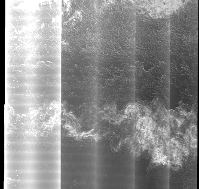
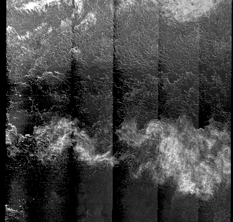
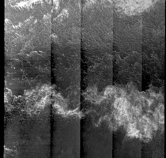
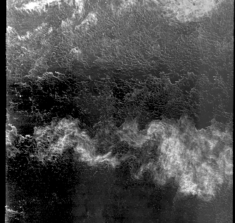

# Sentinel-1 noise floor removal engine
Author: Peter Q Lee. pqjlee (at) uwaterloo (dot) ca
## About
This library provides algorithms to remove noise floor intensity patterns that are prevelant in
Sentinel-1 cross-polarized images in EW mode, and to a lesser degree, IW mode. This is provided in
four ways\: a command line interface, a Python interface, a Rust interface, and a C interface. Currently the library has only been tested in a Linux environment (Ubuntu 16.04 and 19.10), but testing for Windows is planned for the future. (A Windows binary is provided at https://github.com/PeterQLee/sentinel1_denoise_rs/releases)


The algorithms in this library make use of convex optimization to construct noise floors that can be
subtracted to correct the image. Two main algorithms are implemented that make use of the
information provided in the Sentinel-1 xml files.

 1. A linear noise floor removal method that rescales the default noise floor
    that is provided in each Sentinel-1 product. This is the application of the method in
    P. Q. Lee, L. Xu, D. A. Clausi. 2020. Sentinel-1 additive noise removal from cross-polarization
    extra-wide TOPSAR with dynamic least-squares. Remote Sensing of
    Environment. 248. https://doi.org/10.1016/j.rse.2020.111982 . Currently only available in GRD EW mode images.

 2. A non-linear noise floor removal method that computes the noise floor as a power function of
    the antenna pattern. Parameters are estimated with linear programming. This is the application
    of the method in http://www.eng.uwaterloo.ca/~pqjlee/lp_paper_aug14_2020.pdf . Can be applied to both EW and IW GRD mode images.

### Example comparison

 Original | ESA (Linear with k = [1,1,1,1,1] | LinearEst | LPEst 
 ---- | ---- | ---- | ---- 
  |  |  |  

## Citing
If you use this in your work please cite the following:
```bibtex
@Article{pqjlee_linear,
  author =       {P. Q. Lee and L. Xu and D. A. Clausi},
  title =        {{Sentinel-1} Additive Noise Removal from Cross-Polarization Extra-Wide {TOPSAR} with Dynamic Least-Squares},
  journal =      {Remote Sensing of Environment},
  year =         {2020},
  volume =    {248},
  pages =     {111982},
  month =     {October},
  note =      {},
  doi = {https://doi.org/10.1016/j.rse.2020.111982},
  url = {http://www.sciencedirect.com/science/article/pii/S0034425720303527}
}

@Unpublished{pqjlee_LP,
  author =       {P. Q. Lee and L. Xu and D. A. Clausi},
  title = 	 {Estimating Noise Floor in {Sentinel-1} Images with Linear Programming and Least Squares},
  year = {2020},
  note = {Draft paper can be found at \url{http://www.eng.uwaterloo.ca/~pqjlee/lp_paper_aug14_2020.pdf}
  }
  

```
## Installation

This software has several prerequisites

1. A C compiler
2. The rust compiler/manager: cargo
As these algorithms are written in rust, you will need to install the appropriate tools in order to
compile it for your computer. You will need to install the nightly rust toolchain by doing the followinng.
i. Get rustup. Visit [https://rustup.rs] 
ii. Install rust nightly. Run `rustup toolchain install nightly` and then `rustup default nightly`.
iii. You may need to start a new shell.

3. OpenBLAS library [https://github.com/xianyi/OpenBLAS].
This can be installed with your package manager: (e.g. ubuntu/debian `sudo apt install openblas-dev`).

4. HDF5 library version 1.10, with development headers [https://support.hdfgroup.org/ftp/HDF5/releases/hdf5-1.10/hdf5-1.10.6/]
This can be installed with your package manager: (e.g. ubuntu/debian `sudo apt install hdf5lib-dev`) currently, although future versions may break this.

5. Splitting conic-solver library [https://github.com/cvxgrp/scs]. Once downloaded, run `sudo make install`.

6. Fortran libraries `sudo apt install libgfortran-dev`

7. Optional - CMake version 3.12 or above [https://cmake.org/download/]. If you are installing this on linux, you can probably get away without using cmake, although you'll need to manually move some files (specifically the location of the python library). This is likely needed for windows builds.

If you have ubuntu or debian installed you can install all the requirements by opening the Terminal (Command line) and running:

```
curl --proto '=https' --tlsv1.2 -sSf https://sh.rustup.rs | sh
rustup toolchain install nightly
rustup default nightly

sudo apt-get install build-essential openblas-dev hdf5lib-dev cmake libgfortran-dev


git clone https://github.com/cvxgrp/scs
cd scs
sudo make install
cd ../

git clone https://github.com/PeterQLee/sentinel1_denoise_rs
cd sentinel1_denoise_rs
```

### Installing
First make sure you've installed all the pre-requisites described above. *Be sure to do the following in a new Terminal shell so your PATH is updated*. You now have two options for installation. The CMake way and the Non-CMake way.

#### CMake
Create the build scripts using the standard procedure for building cmake projects on your system (see https://cmake.org/runningcmake/)

On unix this can be done with the following
```bash
mkdir build
cd build
cmake ../
make
sudo make install
```
If this built, then everything should be in the proper space for system-wide use. Note for the last step, you might not be able to find cargo in sudo mode, so you might need to do `sudo ln -s $HOME/.cargo/bin/cargo /usr/local/bin` first, depending on your configuration.

#### Non-CMake
```bash
cargo build --release
```
It is up to you to move the output files to useful destinations.

## Usage
There are four methods to utilize the library a command line tool, and the three programmatic
interfaces: a python interface, a C interface, and a rust interface. 
### Command Line
Compiling the library will produce a command line tool called `denoise_s1`. This tool reads the data
from Sentinel-1 archives (either in unzipped or zipped form) and outputs the processed data into
hdf5 files. Note that this requires the archives to be *complete* with all files intact, as the
methods rely on the XML files within the product. 

The tool can be executed with

```bash
denoise_s1 [OPTIONS] <opmode> <inputsar> <outputsar>
```
Use ```denoise_s1 --help``` for usage options.

Example usage: 
```bash
denoise_s1 -m 16,16,16 LPEst S1A_EW_GRDM_1SDH_20180902T164932_20180902T165032_023522_028FAA_5A8B.SAFE output.hdf5
```

* `<opmode>` is used to indicate the algorithm you wish to apply to the data
> * `LinearEst`: applies linear rescaling of the default noise floor estimated with least squares estimation. Writes three hdf groups to `<outputsar>`\
>> `crosspol`: the processed cross-polarized image in square units\
>> `copol`: the unprocessed co-polarized image in linear units\
>> `k`: the estimated linear scales.

> * `LinearApply`: Applies the linear scaling method using custom user provided scales, k. This requires the `<paramhdf>` flag to be specified, with the group `k` holding the parameters. Writes three hdf groups to `<outputsar>`
>> `crosspol`: the processed cross-polarized image in square units\
>> `copol`: the unprocessed co-polarized image in linear units\
>> `k`: the scaling values provided by the user.

> * `Raw`: Returns the raw data information. Writes three hdf groups to `<outputsar>`
>> `crosspol`: the unprocessed cross-polarized image in linear units\
>> `copol`: the unprocessed co-polarized image in linear units\
>> `y`: the default noise floor estimate in linear units

> * `LPEst`: Generates a noise floor estimate to be power functions of the antenna radiation pattern strength with respect to range. This is the most advanced and computationally expensive method that requires multiple linear programs to be solved. As a result, it is recommended to store `m` and `b` after computation and run `LPApply` if you need to regenerate the image. Writes six groups to `<outputsar>`.
>> `crosspol`: the processed cross-polarized image in square units\
>> `copol`: the unprocessed co-polarized image in linear units\
>> `k`: the scaling values provided by the user.\
>> `m`: the slopes in the power functions, in order of subswaths and range splits\
>> `b`: the slopes in the power functions, in order of subswaths and range splits\
>> `subswaths`: the number of subswaths in the image.

> * `LPApply`: Applies power function method to the image using user provided parameters. This requires the `<paramhdf>` flag to be specified, with the groups `m` and `b` holding the parameters. Writes two groups to `<outputsar>`
>> `crosspol`: the processed cross-polarized image in square units\
>> `copol`: the unprocessed co-polarized image in linear units

* `<inputsar>` is the path to the Sentinel-1 archive. It can either be in the .zip form or the unzipped directory. It is required that all files are intact.
* `<outputsar>` is the path to the output hdf5 file.


* `OPTIONS` present a number of optional flags that influence the selected `<opmode>`.
> * `-c=[path]`, `--config=[path]`: path to a configuration .ini file with parameters to modify the algorithms. An example .ini file is given in as base_config.ini.
> * `-p=[path]`, `--paramhdf=[path]`: a path to an hdf5 file holding parameter values.
> * `-r`, `--nolstsq_rescale`: = indicates not to apply `LinearEst` before `LPEst` and to use default noise floor without scaling. Ignored for IW images. Ignored in every mode except `LPEst`.
> * `-m=row,col,cores`, `--multilook=row,col,cores`: applies multilook processing to all of the output images. It reduces the output dimensions by a factor of `row` and `col` along the rows and columns respectively. `cores` indicates the number of CPU cores to use during processing. **Note that this results in the values of the images being converted to linear units. Any negative values after multilooking are rounded to zero.**

### Program interface
The other programming interfaces have the exact same functionalities as the command line interface,
but output the data directly into your program environment rather than writing the data to the
file. For brevity, only the python interface will be discussed in detail, because the functions in the C
and rust interface are nearly identical. The rust interface can be seen [here](engine/src/interface.rs) and the C interface can be seen [here](include/interface.h).

Example:

```python
import s1_noisefloor
hv, hh, m, b, k = s1_noisefloor.lp_get_dualpol_data(path_to_zip, True, None)
hv_multilooked = s1_noisefloor.post_multilook_and_floor(hv, 16, 16, 8)
```


#### Reference functions

* `s1_noisefloor.linear_get_dualpol_data(archpath, config_path)`
> Applies the lstsquares estimation method to retrieve scaling parameters, k,
> rescales the noise floor, y, and subtracts it from the image, x.
> Returns the values back in square intensity units.
>
> Parameters:
>
> archpath: str
>>     Path to the zip or directory unpacked from the Sentinel-1 zip archive
> config_path: str or None
>>     Optional path to config file. If None (or non-string) will use default configuration.
>
> Returns:
> (cross, co, k)
>
> cross: ndarray(2)
>>    array holding processed cross-polarized measurements (square)
> co: ndarray(2)
>>    array holding unprocessed co-polarized measurements (linear)
> k: ndarray(1)
>>    array of the estimated linear parameters
>
> Returns: (_crosspol_, _copol_, _k_)
>> Where crosspol is the hv or vh image denoised with my method.
>> copol is the hh or vv image.
>> k is the denoising coefficients produced by my method

* `s1_noisefloor.linear_get_customscale_data(archpath, k)`
> Applies the linear scaling method using custom user provided scales, k.
> Returns the values back in square intensity units.
>
> Parameters:
>
> archpath: str
>>     Path to the zip or directory unpacked from the Sentinel-1 zip archive
> k: ndarray(1)
>>     One dimensional array in 64-bit float that indicates the linear scaling parameters
>>     to apply to each subswath. Length of array must equal five.
>>     To apply the standard ESA noise removal, make k = np.array([1.0,1.0,1.0,1.0,1.0])
>
>
> Returns:
> (cross, co)
>
> cross: ndarray(2)
>>    array holding processed cross-polarized measurements (square)
> co: ndarray(2)
>>    array holding unprocessed co-polarized measurements (linear)
>


* `s1_noisefloor.linear_get_raw_data(archpath)`
> Returns the original cross pol, co pol, and noise field from the archive.
> Note that arrays are in linear units.
>
> Parameters:
>
> archpath: str
>>     Path to the zip or directory unpacked from the Sentinel-1 zip archive
>
> Returns:
> (cross, co, y)
>
> cross: ndarray(2)
>>    array holding unprocessed cross-polarized measurements (linear)
> co: ndarray(2)
>>    array holding unprocessed co-polarized measurements (linear)
> y: ndarray(2)
>>    array holding noise field (linear)

* `s1_noisefloor.lp_get_dualpol_data(archpath, lstsq_rescale, config_path)`
> Applies the linear programming method to restimate a noise floor based
> on the characteristics of the original image and the 
> Returns the values back in square intensity units.
>
> Parameters:
>
> archpath: str
>>     Path to the zip or directory unpacked from the Sentinel-1 zip archive
> lstsq_rescale: bool
>>     Indicate whether you want to apply the least squares method from
>>     linear_get_dualpol_data to get the baseline minimum offset values for
>>    the method. Ignored if product type is 
>>     true for applying the method
>>     false to just use the default ESA noise floor for this.
> config_path: str or None
>>     Optional path to config file. If None (or non-string) will use default configuration.
>
> Returns:
> (cross, co, m, v)
>
> cross: ndarray(2)
>>    array holding processed cross-polarized measurements (square)
> co: ndarray(2)
>>    array holding unprocessed co-polarized measurements (linear)
> m: ndarray(1)
>>    Array of slope / exponent parameters estimated.
> b: ndarray(1)
>>    Array of intercept parameters estimated
> k: ndarray(1)
>>    Array of linear scales computed by prior to applying the LP.

* `s1_noisefloor.lp_get_customscale_data(archpath, m, b, config_path)`
>  Applies the power function noise floor obtained from linear programming,
>   with parameters given by the user.
>   Returns the values back in square intensity units.
> 
> Parameters:
>
> archpath: str
>>     Path to the zip or directory unpacked from the Sentinel-1 zip archive
> m: list
>>     List of slope parameters
> b: list
>>     List of intercept parameters.
> config_path: str or None
>>     Optional path to config file. If None (or non-string) will use default configuration.

> Returns:
> (cross, co)
>
> cross: ndarray(2)
>>    array holding processed cross-polarized measurements (square)
> co: ndarray(2)
>>    array holding unprocessed co-polarized measurements (linear)


* `s1_noisefloor.post_multilook_and_floor(x, row_factor, col_factor, num_cores)`
> Applies multilooking to the input image, sets negative values to 0, and
> square roots the output values.
>
> Parameters:
> x: ndarray 
>>    Input array for multilooking (square units)
> row_factor: integer
>>    integer amount to mean reduce row by.
> col_factor: integer
>>    integer amount to mean reduce col by.
> num_cores: integer
>>    number of multithreading cores to use.
>
> Output:
>> x : multilooked image (linear units)


#### C interface

Assuming everything built properly, you should be able to use the header file like
```C
#include <s1_noisefloor/interface.h>
```

Then compiling will be something like:
```bash
gcc -ls1_noisefloor -lpython3.X program.c -o program
```
where X is the python version on your computer.

#### Rust interface

Documentation for the rust interface can be found here:
https://peterqlee.github.io/doc/s1_noisefloor_engine/index.html
